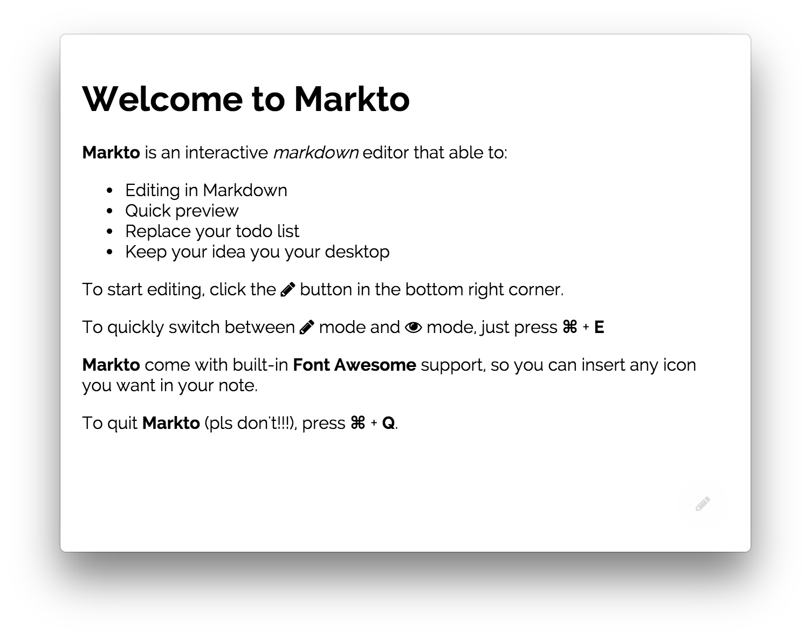

# Welcome to Markto

**Markto** is an interactive _markdown_ editor that able to:
- Editing in Markdown
- Quick preview
- Replace your favorite todo list apps
- Keep your idea in your eyes on your desktop

To start editing, click the **Pencil** button in the bottom right corner.

To quickly switch between **Edit** mode and **Preview** mode, just press **⌘** + **E**

Press **⌘** + **S** to save your note.

**Markto** come with built-in **Font Awesome** support, so you can insert any icon you want in your note.

To quit **Markto** (pls don't!!!), press **⌘** + **Q**.
